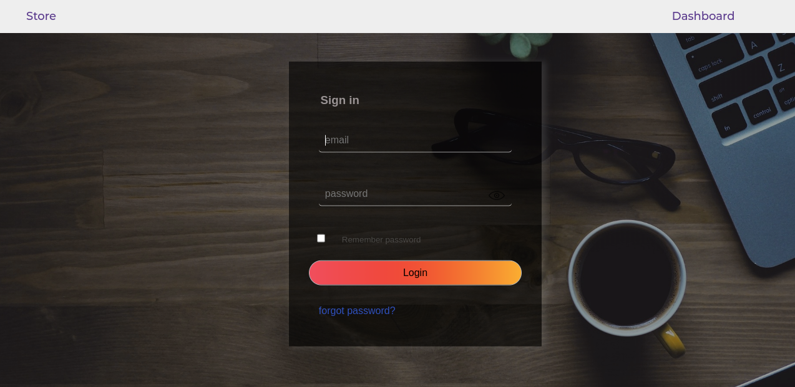
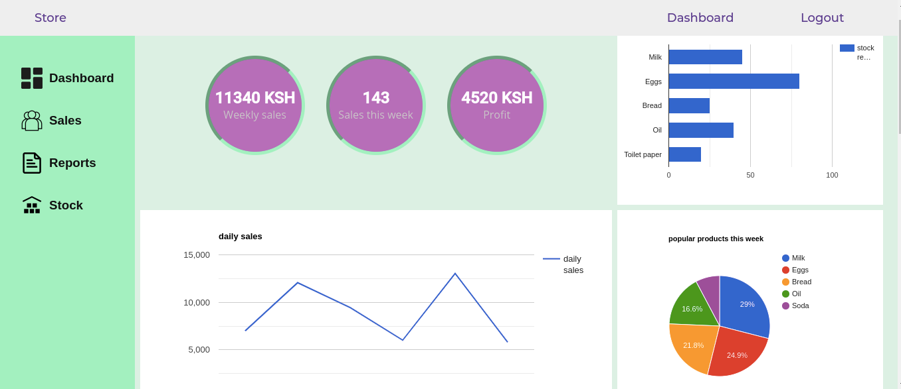
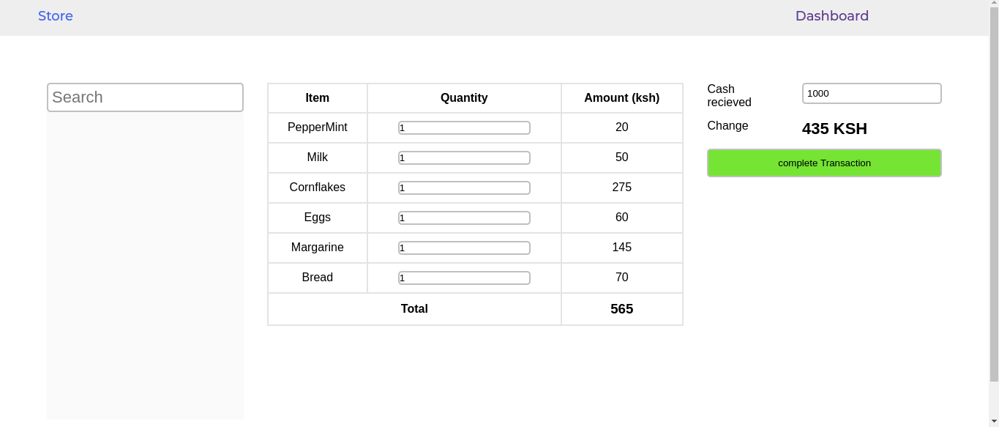

# store-manager
store management system
#### the system is designed for Point of sale tasks and also will contain data visualization of how the shop is doing 
#### features
* automatic recording of sales for each attendant
* shop attendant can view sales records and other relevant statistics
* shop attendant can add products to cart 
  
#### admin features
* view profit
* view sales records of each attendant
* view relevant statistics
* add attendants
* add products to the system
  
#### completed features
1. store attendant dashboard UI
2. login UI template
3. POS (point of sale) UI(needs better styling maybe)
4. Registering a new Store Attendant UI
 

link https://alexmagwe.github.io/store-manager/

pivotal tracker link https://www.pivotaltracker.com/n/projects/2463673
### index page

### shop attendant dashboard

### Point of sales page

